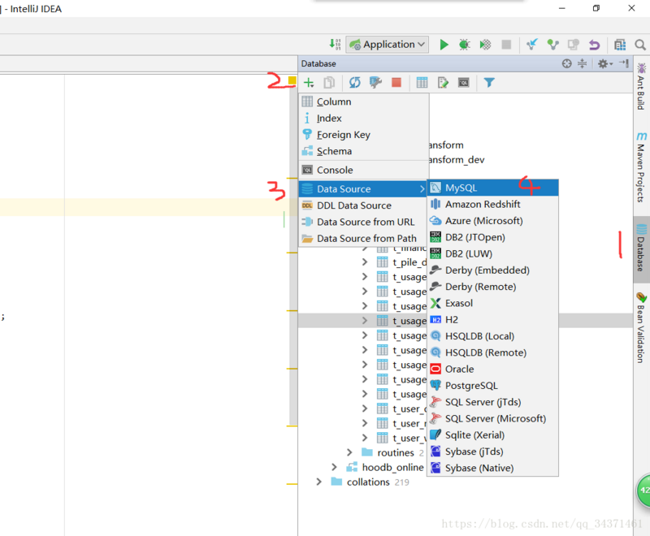
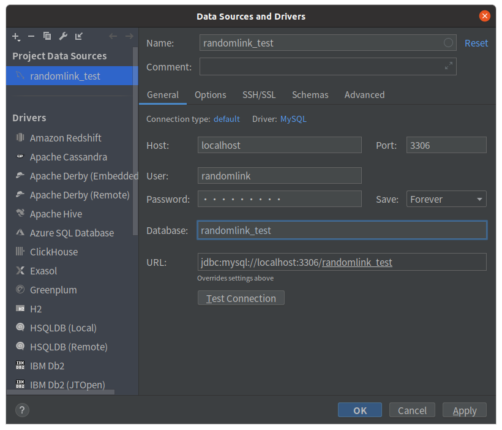
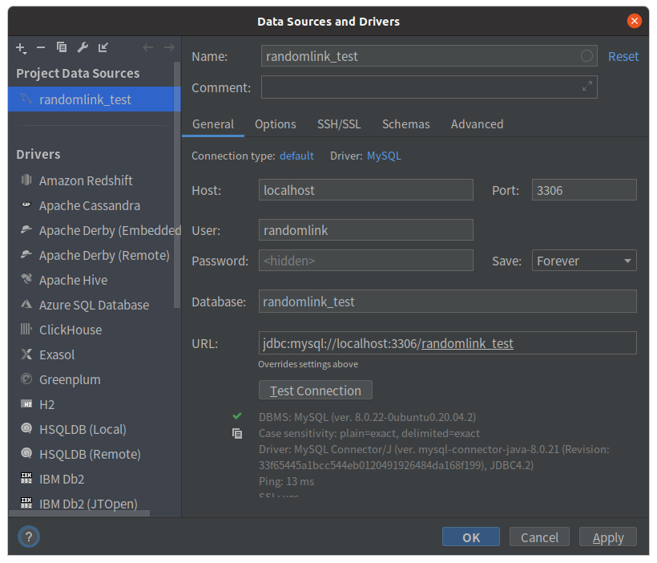
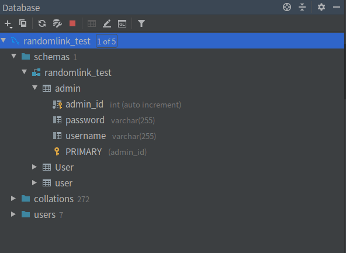
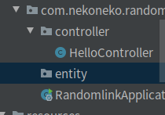
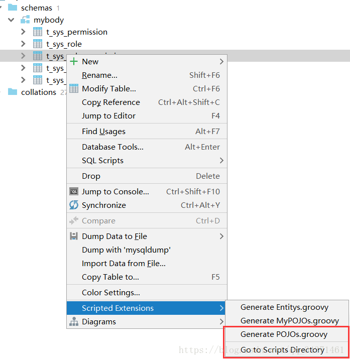
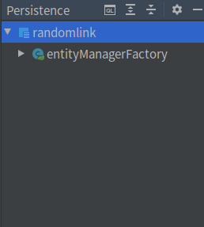
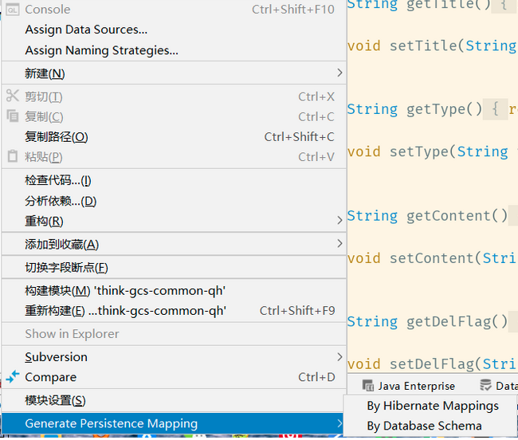
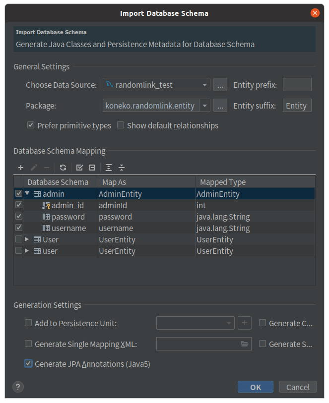

# IDEA生成实体类

> Author: CAI Pengfei 

有没有感觉一个一个的将数据库中的表都敲成实体类感觉很烦呢？一个还行，上百个表怎么办？有没有便捷工具呢？当然是有的。下面我们将介绍如何使用IDEA生成实体类。

> 该方法适用于IDEA Ultimate 和 IDEA Community

> 本文使用IDEA Ultimate 2020.1作为示例

### 1. 将IDEA连接数据库

**Step1**: 添加数据库。点击菜单栏View > View-Tool Window > Database或窗口右侧菜单栏Database来添加数据库连接。



**Step2**: 配置数据库连接



**Step3**: 测试数据库连接



点击ok，确认添加成功。



**Step4**：在项目中创建用于存储实体类的文件夹。



## 2. 如果想生成普通Java对象（POJO）



然后就可以生成了：

```java
package com.sample;


public class Admin {

  private long adminId;
  private String password;
  private String username;


  public long getAdminId() {
    return adminId;
  }

  public void setAdminId(long adminId) {
    this.adminId = adminId;
  }


  public String getPassword() {
    return password;
  }

  public void setPassword(String password) {
    this.password = password;
  }


  public String getUsername() {
    return username;
  }

  public void setUsername(String username) {
    this.username = username;
  }

}
```

当然package名称需要修改。

## 3. 如果你想生成hibernate类型带注解的POJO

点击View > View-Tool Window > Persistance。或左侧栏的Persistance。



右键randomlink，选择Generate Persistance Mapping > By Database Schema




填写相关讯息：

1. choose data source: 选择刚才的建立的database连接
2. package：选择生成的POJO的存储包名
3. prefix：是生成的实体类的前缀
4. suffix：是生成的实体类的后缀
5. 在Database Schema Mapping选择你想生成的表格，在里面可以编辑Map As和Mapped Type
6. 勾选Generate JPA Annotations (Java 5)
7. 点击OK



即可生成：

```java
@Entity
@Table(name = "admin", schema = "randomlink_test", catalog = "")
public class AdminEntity {
    private int adminId;
    private String password;
    private String username;

    @Id
    @Column(name = "admin_id")
    public int getAdminId() {
        return adminId;
    }

    public void setAdminId(int adminId) {
        this.adminId = adminId;
    }

    @Basic
    @Column(name = "password")
    public String getPassword() {
        return password;
    }

    public void setPassword(String password) {
        this.password = password;
    }

    @Basic
    @Column(name = "username")
    public String getUsername() {
        return username;
    }

    public void setUsername(String username) {
        this.username = username;
    }

    @Override
    public boolean equals(Object o) {
        if (this == o) return true;
        if (o == null || getClass() != o.getClass()) return false;
        AdminEntity that = (AdminEntity) o;
        return adminId == that.adminId &&
                Objects.equals(password, that.password) &&
                Objects.equals(username, that.username);
    }

    @Override
    public int hashCode() {
        return Objects.hash(adminId, password, username);
    }
}

```

## 4. 自定义生成POJO

本文略，请查阅：https://programmer.group/5d6399803e956.html