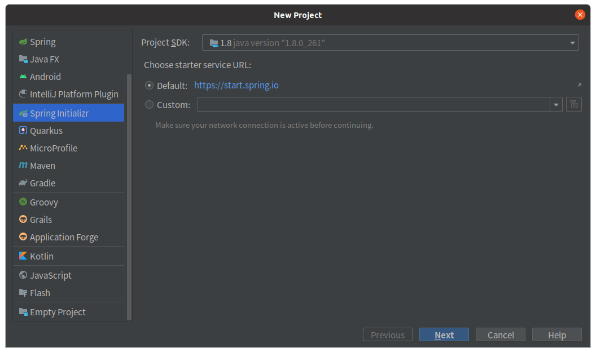
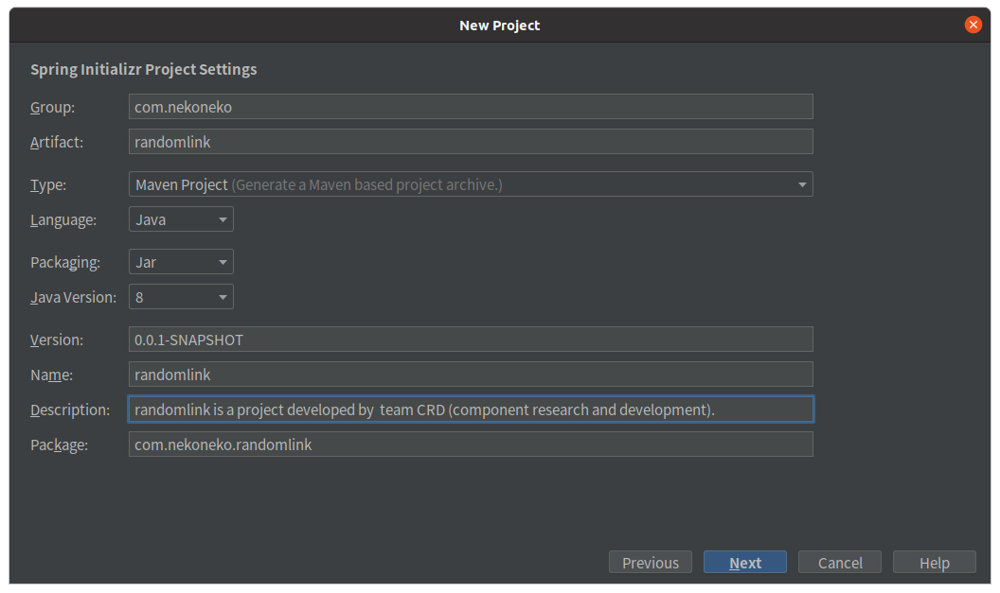
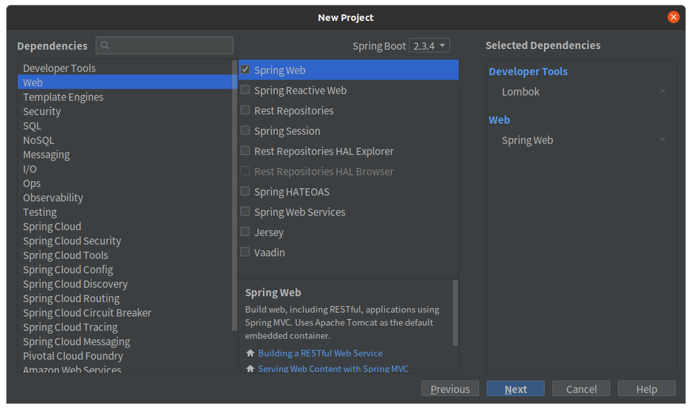
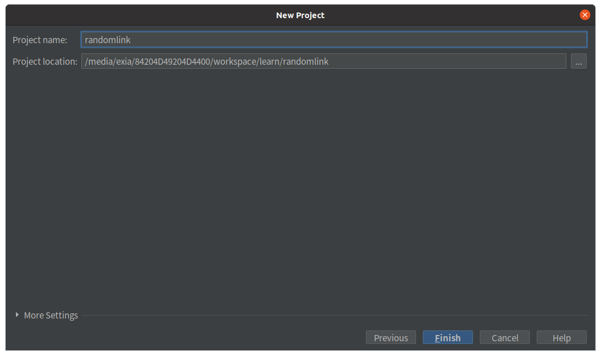
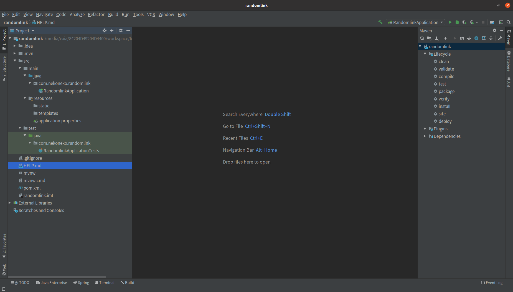
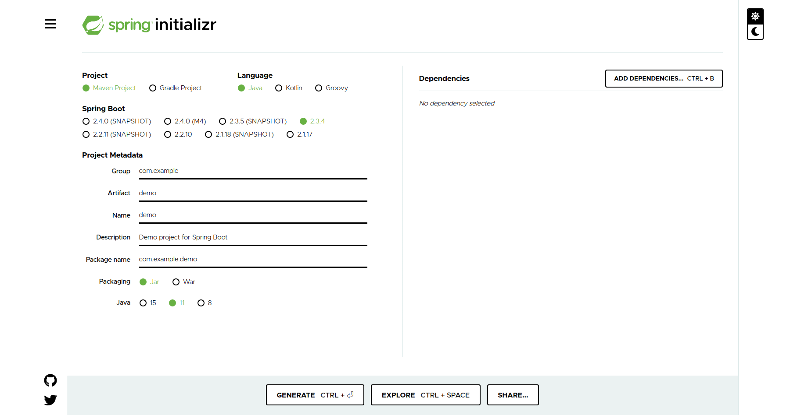
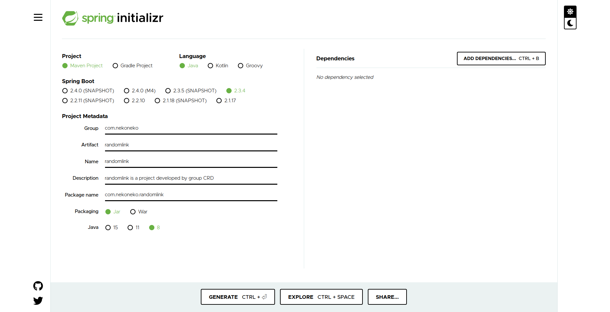
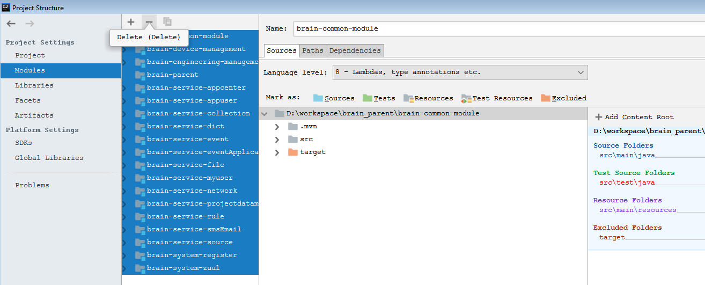
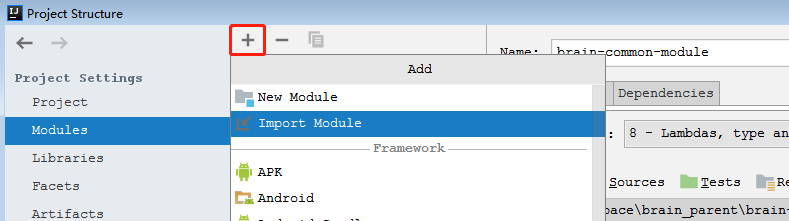
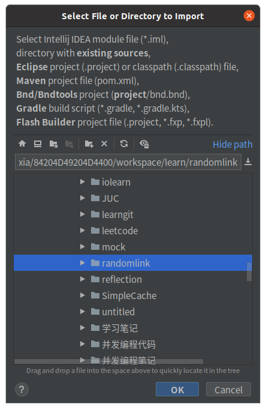

# Getting Started
此项目将从头开始搭建一个相对完整的web项目。

> 本教程基于ubuntu os

## 1. maven更换国内镜像源
由于国内直接下载maven仓库速度较为缓慢，可以将maven的下载地址更改为国内服务器。以阿里云为例

```shell
gedit ~/.m2/settings.xml
```

如果`.m2`文件夹中没有settings.xml可在maven安装文件夹中`<maven_root>/conf/`下找到，将其拷贝到`.m2`文件夹下，然后编辑。

在mirrors元素中添加：

```xml
<mirror>
   <id>alimaven</id>
   <mirrorOf>central</mirrorOf>  
   <name>aliyun maven</name>
   <url>http://maven.aliyun.com/nexus/content/groups/public/</url>      
</mirror>
```

## 2. 创建spring boot项目

有两种创建方式。

### 2.1 第一种创建方式
如果你使用的是idea ultimate，可以在新建项目中选择Spring initializr.

**Step1**



**Step2**：填写项目的相关信息



**Step3**：勾选可能会用到的依赖（可选，可以以后再pom.xml手动引入）

勾选
- Developer Tools - Lombok
- Web - Spring Web



**Step4**：选择项目存储位置



**Step5**：创建完成


### 2.2 第二种创建方式
如果你使用的是idea community，你会找不到Spring initializr，这个时候就要使用Spring官网给出的创建方式。

**Step1**：打开Spring initializr官网：https://start.spring.io/



**Step2**: 填写项目的相关信息，然后点击Generate。然后就会下载生成的项目文件`randomlink.zip`



**Step3**:解压，并用idea打开。如果你是idea ultimate，就会自动载入为spring boot项目，即创建完成。如果是idea community还需要 step4


**Step4**: 用idea community打开，点击File - Project Structure - Modules，清除所有Modules。



**Step5**：点击添加Modules



**Step6**：在弹出的窗口中选择本项目的文件夹，然后点击ok，别忘了点击project structure窗口的ok，即导入完成。最后刷新maven。



## 3. Hello Word
创建一个简单的web应用，首先创建HelloController
> 路径名均相对于 `src/main/java/com.nekoneko.randomlink`

*controller.HelloController*

```java
@RestController
public class HelloController {
    @RequestMapping
    public String index(){
        return "Your first spring boot application";
    }
}
```
这个类用`@RestController`进行标注，表示该类使用Spring MVC来处理web 请求，@RequestMapping表示当请求为`url:port/`时，进行调用。`@RestController`实则为`@Controller`和`@ResponseBody`的结合版，两个表示该类处理web请求，并返回字符串数据而不是网页视图。


在idea中运行来启动应用，然后在终端中输入命令：
```shell
$ curl 127.0.0.1:8080
Your first spring boot application
```

在网页中输入`127.0.0.1:8080`也可看到一致的结果

## 打包部署（jar包）
在项目根目录下输入
```shell
$ mvn clean package -Dmaven.test.skip=true
```
即可打包成jar包

**运行**
```shell
$ cd target
$ java -jar randomlink-0.0.1-SNAPSHOT.jar
```
然后在另一个终端中输入命令：
```shell
$ curl 127.0.0.1:8080
Your first spring boot application
```

**问题解决**

如果遇到mvn命令不存在，说明mvn没有添加到环境变量中，
在`./bashrc`中添加：

```shell
# >>> maven >>>
export MAVEN_HOME=/home/exia/programs/idea-IU-201.6668.121/plugins/maven/lib/maven3
export PATH=${MAVEN_HOME}/bin:$PATH
# <<< maven <<<
```
