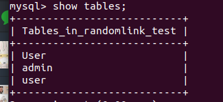
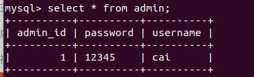

# JPA-Hibernate

**Step1**：添加依赖

*pom.xml*

```xml
<dependency>
    <groupId>org.springframework.boot</groupId>
    <artifactId>spring-boot-starter-data-jpa</artifactId>
</dependency>

<dependency>
    <groupId>mysql</groupId>
    <artifactId>mysql-connector-java</artifactId>
</dependency>
```


**Step2**：配置文件

*applications.yml*

```yml
spring:
  datasource:
    url: jdbc:mysql://localhost:3306/randomlink_test
    username: randomlink
    password: linkstart
    driver-class-name: com.mysql.cj.jdbc.Driver
  
  jackson:
    serialization: 
      indent-output:
        true

  jpa:
    hibernate:
      ddl-auto: update
    show-sql: true
```

**Step3**：编写实体类

*entity.Admin*

```java
@Data
@Entity
@Table(name = "admin")
public class Admin {

    @Id
    @GeneratedValue(strategy = GenerationType.IDENTITY)
    private Integer adminId;

    @Column(name = "username")
    private String username;

    @Column
    private String password;
}
```

**Step4**：编写repository，即dao层。

*repository.AdminRepository*

```java
public interface AdminRepository extends JpaRepository<Admin, Integer> {
}
```

**Step5**：编写Controller

```java 
@RestController
public class HelloController {

    @Autowired
    private AdminRepository adminRepository;

    @RequestMapping
    public String index(){
        Admin admin = new Admin();
        admin.setUsername("cai");
        admin.setPassword("12345");
        adminRepository.save(admin);
        return "Your first spring boot application";
    }
}
```

运行后的结果：发现新增了表admin



查看表格内容：



