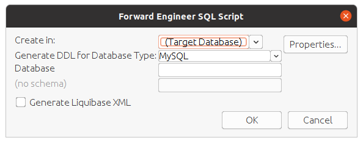
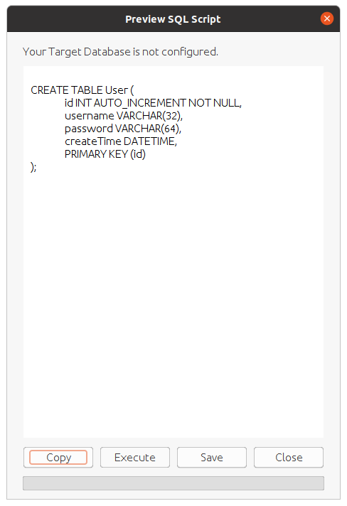

# MyBatis 

## 1. 创建关系型数据库(RDB)

**Step1**: 数据库结构设计


**Step2**：点击sql语句生成按钮

**Step3**：选择生成的数据库种类



**Step4**：点击ok生成，并复制sql语句



**Step5**：复制到sql workbench执行sql语句


**Step6**：检查有没有生成user表

```mysql
SHOW TABLES:
```


## 整合mybatis

**Step1**：添加依赖 *pom.xml*

```xml
<dependency>
    <groupId>org.mybatis.spring.boot</groupId>
    <artifactId>mybatis-spring-boot-starter</artifactId>
    <version>2.1.3</version>
</dependency>

<dependency>
    <groupId>mysql</groupId>
    <artifactId>mysql-connector-java</artifactId>
</dependency>
```

关于`mybatis-spring-boot-starter`的版本需要注意：

- `2.1.x`版本适用于：MyBatis 3.5+、Java 8+、Spring Boot 2.1+
- `2.0.x`版本适用于：MyBatis 3.5+、Java 8+、Spring Boot 2.0/2.1
- `1.3.x`版本适用于：MyBatis 3.4+、Java 6+、Spring Boot 1.5

其中目前还维护的是`2.1.x`版本和`1.3.x`版本


**Step2**：在 *application.properties*中配置mysql连接配置

```yml
spring:
  datasource:
    url: jdbc:mysql//127.0.0.1:3306/randomlink_test
    username: randomlink
    password: linkstart;
    driver-class-name: com.mysql.cj.jdbc.Driver
```

**Step3**：创建User实体类和User表的操作接口 *UserMapper*。在接口中定义两个数据的操作，分别是查询和操作

*User*

```java
@Data
@NoArgsConstructor
@AllArgsConstructor
public class User {
    private long id;
    private String username;
    private String password;
    private Date createTime;
}
```

*UserMapper*

```java
@Mapper
public interface UserMapper {

    @Select("select * from User")
    List<User> getAllUsers();

    @Results({
            @Result(property = "id", column = "id"),
            @Result(property = "username", column = "u"),
            @Result(property = "password", column = "p"),
            @Result(property = "createTime", column = "createTime")
    })
    @Select("select username as u, password as p, id as id, createTime as createTime from User where id=#{id}")
    User getUserById(Long id);

    @Select("select * from User where username like concat('%', #{name}, '%')")
    List<User> getUserByUsername(String name);

    @Insert({"insert into User(username,password,createTime) values(#{username},#{password}, #{createTime})"})
    @SelectKey(statement = "select last_insert_id()", keyProperty = "id", before = false, resultType = long.class)
    long addUser(User user);

    @Update("update User set username=#{username}, password=#{password}, createTime=#{createTime} where id=#{id}")
    long updateUserById(User user);

    @Delete("delete from User where id=#{id}")
    long deleteUserById(long id);
}
```

**Step4**：测试

*UserMapperTest*

```java
@SpringBootTest
@ExtendWith(SpringExtension.class)
class UserMapperTest {

    @Autowired
    private UserMapper userMapper;

    @Test
    @Rollback
    public void test() throws Exception {
        User user1 = new User();
        user1.setUsername("cai");
        user1.setPassword("12345");

        User user2 = new User();
        user2.setUsername("wang");
        user2.setPassword("45678");
        userMapper.addUser(user1);
        userMapper.addUser(user2);

        List<User> users = userMapper.getAllUsers();
        System.out.println(users);
    }
}
```

**Step5**：观察数据库里面的数据


