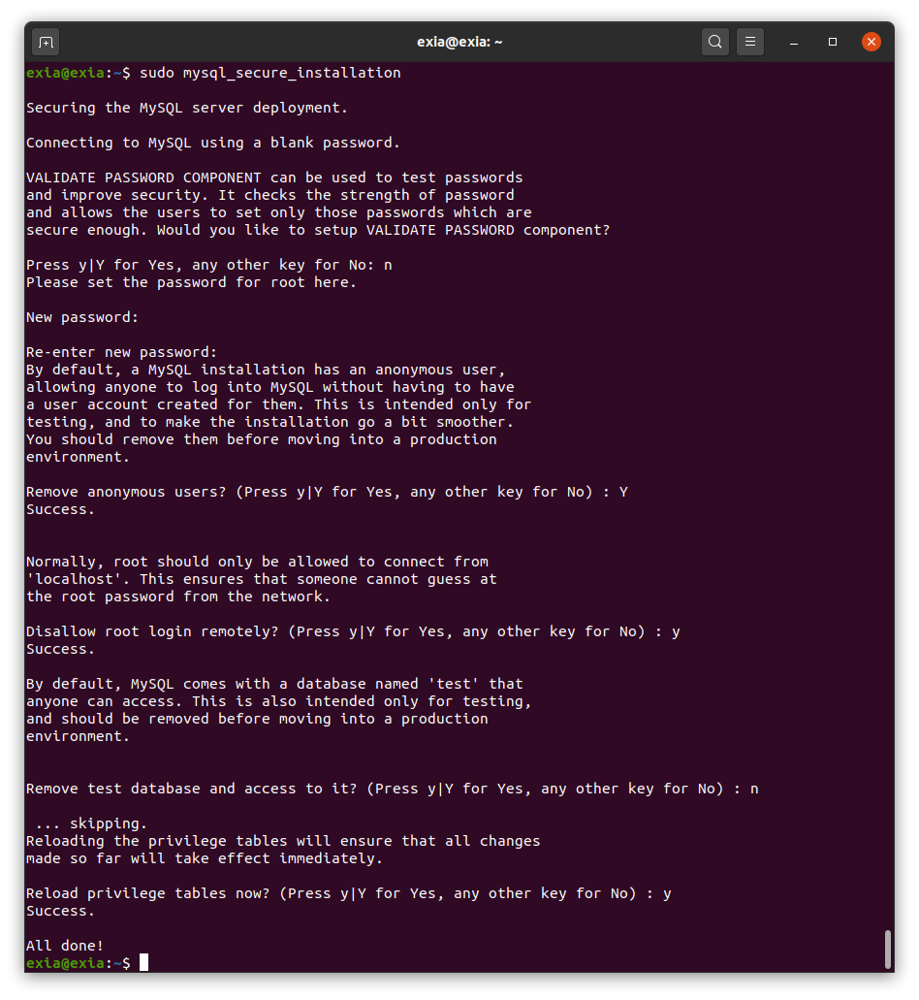
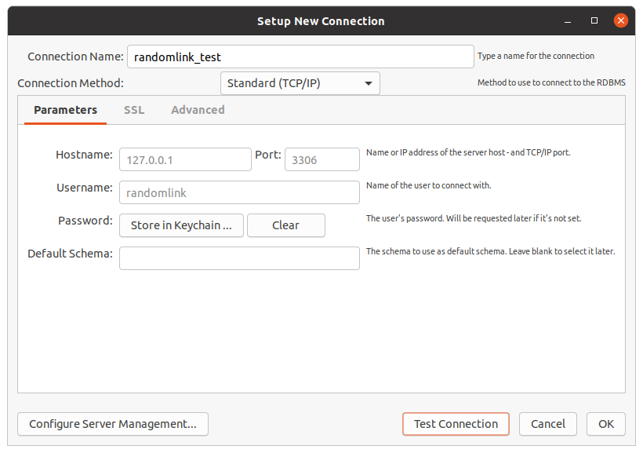
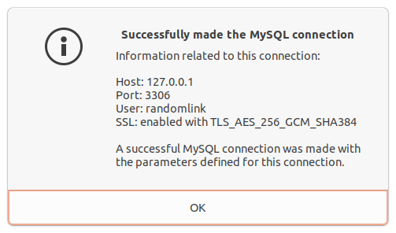

# 安装 MySQL


## 1. 安装MySQL server
在 Ubuntu 中，默认只有最新版本的 MySQL 包含在 APT 软件包存储库中。

```bash
$ sudo apt update
$ sudo apt install mysql-server
```

这一步不会进行一些配置相关的提示（例如：设置密码），因为会使 MySQL 的安装不安全，我们将在下一步解决该问题。

## 2. 配置MySQL

```bash
$ sudo mysql_secure_installation
```



重点说一下第一个提示，这会询问我们是否愿意设置验证密码插件，该插件可用于测试 MySQL 密码的强度。

## 3. 创建用户并授权

### 3.1 创建用户
```sql
CREATE USER 'usernamexxx'@'hostxxx' IDENTIFIED BY 'passwordxxx';
```

**说明**:

`hostxxx`：指定该用户在哪个主机上可以登陆，如果是本地用户可用localhost，如果想让该用户可以从任意远程主机登陆，可以使用通配符`%`

`passwordxxx`：该用户的登陆密码，密码可以为空，如果为空则该用户可以不需要密码登陆服务器

**示例**：
```sql
CREATE USER 'jack'@'localhost' IDENTIFIED BY '123456';
CREATE USER 'rose'@'192.168.38.110_' IDENDIFIED BY '123456';
CREATE USER 'rose'@'%' IDENTIFIED BY '123456';
CREATE USER 'rose'@'%' IDENTIFIED BY '';
CREATE USER 'rose'@'%';
```

**注意**:

创建用户后，该用户只能连接到数据库服务器，但并没有操作该数据库服务器的权限。

### 3.2 授权

```sql
GRANT privilegesxxx ON databasenamexxx.tablenamexxx TO 'usernamexxx'@'hostxxx'
```

**说明**：

`privilegesxxx`：用户的操作权限，如SELECT，INSERT，UPDATE等，如果要授予所的权限则使用ALL
databasenamexxx：数据库名
`tablenamexxx`：表名，如果要授予该用户对所有数据库和表的相应操作权限则可用`*`表示，如`*.*`

**示例**：

```sql
GRANT SELECT, INSERT ON DbXXX.user TO 'jack'@'%';
GRANT ALL ON *.* TO 'jack'@'%';
GRANT ALL ON DbXXX.* TO 'jack'@'%';
```

**注意**：

1.  授权之后需要用户重连MySQL，才能获取相应的权限。

2. 用以上命令授权的用户不能给其它用户授权，如果想让该用户可以授权，用以下命令:

```sql
GRANT privilegesxxx ON databasenamexxx.tablenamexxx TO 'usernamexxx'@'hostxxx' WITH GRANT OPTION;
```

### 3.3 设置与更改用户密码
```sql
SET PASSWORD FOR 'usernamexxx'@'hostxxx' = PASSWORD('newpasswordxxx');
```

如果是当前登陆用户用:

```sql
SET PASSWORD = PASSWORD("newpasswordxxx");
```

**示例**：

```sql
SET PASSWORD FOR 'jack'@'%' = PASSWORD("123456");
```

### 3.4 撤销用户权限

```sql
REVOKE privilegexxx ON databasenamexxx.tablenamexxx FROM 'usernamexxx'@'hostxxx';
```

**示例**：
```sql
REVOKE SELECT ON *.* FROM 'jack'@'%';
```

**注意**：

假如你在给用户`'jack'@'%'`授权的时候是这样的（或类似的）：`GRANT SELECT ON test.user TO 'jack'@'%'`，则在使用`REVOKE SELECT ON *.* FROM 'jack'@'%';`命令并不能撤销该用户对test数据库中user表的SELECT 操作。相反，如果授权使用的是`GRANT SELECT ON *.* TO 'jack'@'%';`则`REVOKE SELECT ON test.user FROM 'jack'@'%';`命令也不能撤销该用户对test数据库中user表的Select权限。


具体信息可以用命令`SHOW GRANTS FOR 'jack'@'%'; `查看。

###　3.5　删除用户

```sql
DROP USER 'usernamexxx'@'hostxxx';
```

## 4. 配置远程访问
配置远程访问

默认情况下，MySQL 只监听本地主机（localhost）的连接。若要启用远程连接，需要进行以下配置。

1. 编辑 MySQL 的 mysqld.cnf 配置文件：

```bash
$ sudo vim /etc/mysql/mysql.conf.d/mysqld.cnf
```

注释掉下面这行配置：

```ini
bind-address          = 127.0.0.1
```
完成之后，保存退出！

2. 执行如下命令，重启 mysql 服务：

```bash
$ sudo systemctl restart mysql
```

## 5. 配置mysql workbench
去官网下载 https://dev.mysql.com/downloads/repo/apt/


然后安装apt源

```bash
$ sudo dpkg -i mysql-apt-config_0.8.15-1_all.deb
```
选择ok回车，

然后安装
```bash
$ sudo apt update
$ sudo apt install mysql-workbench-community
```

**启动**

```bash
$ mysql-workbench
```

**连接测试**

在workbench中新建连接：



点击测试连接


