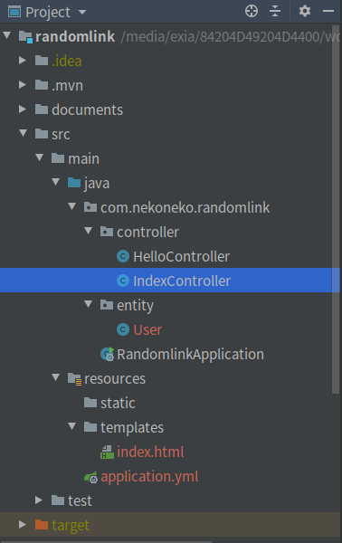
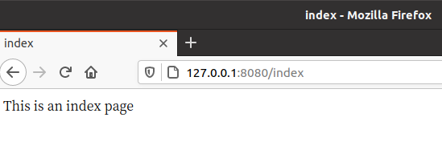
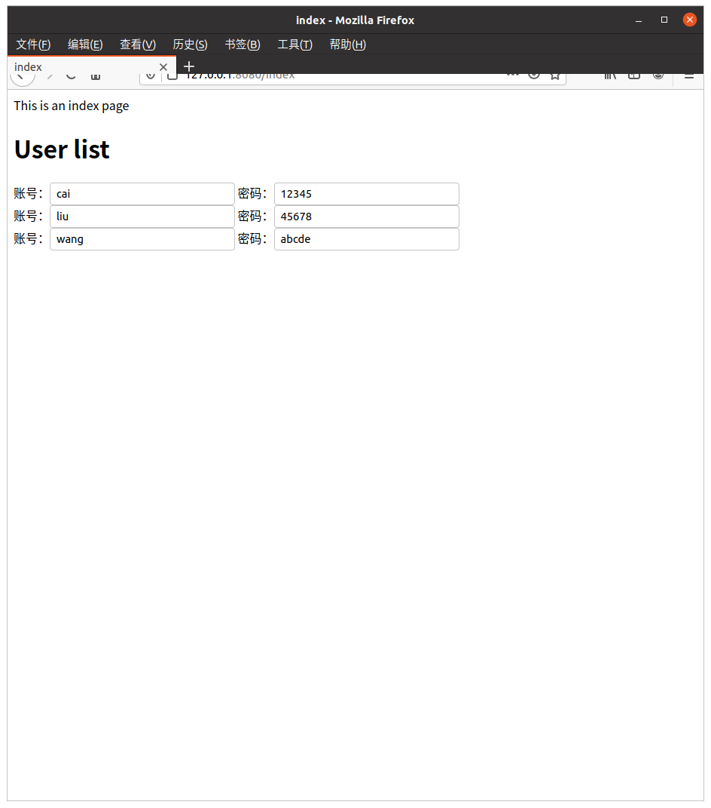

# Thymeleaf
Thymeleaf是一个XML/XHTML/HTML5模板引擎，可用于Web与非Web环境中的应用开发。它是一个开源的Java库，基于Apache License 2.0许可，由Daniel Fernández创建，该作者还是Java加密库Jasypt的作者。

Thymeleaf提供了一个用于整合Spring MVC的可选模块，在应用开发中，你可以使用Thymeleaf来完全代替JSP或其他模板引擎，如Velocity、FreeMarker等。Thymeleaf的主要目标在于提供一种可被浏览器正确显示的、格式良好的模板创建方式，因此也可以用作静态建模。你可以使用它创建经过验证的XML与HTML模板。相对于编写逻辑或代码，开发者只需将标签属性添加到模板中即可。接下来，这些标签属性就会在DOM（文档对象模型）上执行预先制定好的逻辑。

##　使用Thymeleaf构建一个简单的web页面
###　1. 添加依赖
在`pom.xml`中添加 Thymeleaf 依赖

```xml
<dependency>
	<groupId>org.springframework.boot</groupId>
	<artifactId>spring-boot-starter-thymeleaf</artifactId>
</dependency>

<dependency>
    <groupId>org.springframework.boot</groupId>
    <artifactId>spring-boot-starter-web</artifactId>
</dependency>
```

### 2. 构建项目

**项目架构**




### 2.1 最简单版本

*controller/indexController*

```java
@Controller
public class IndexController {

    @GetMapping(value = "index")
    public String index(){
        return "index";
    }
}
```

*resources/templates/index.html*

```html
<!DOCTYPE html>
<html lang="en">
<head>
    <meta charset="UTF-8">
    <title>index</title>
</head>
<body>
This is an index page
</body>
</html>
```

运行后，访问`127.0.0.1:8080/index`即可看到结果



### 2.2 正常版本

*controller/indexController*

```java
@Controller
public class IndexController {

    @GetMapping(value = "index")
    public String index(Model model){
        List<User> users = new ArrayList<>();
        users.add(new User(1L, "cai", "12345", new Date()));
        users.add(new User(1L, "liu", "45678", new Date()));
        users.add(new User(1L, "wang", "abcde", new Date()));
        model.addAttribute("users", users);
        return "index";
    }
}

```


*entity/User*

```java
@Data
@AllArgsConstructor
public class User {
    private long id;
    private String username;
    private String password;
    private Date createTime;
}

```

*resources/templates/index.html*

```html
<!DOCTYPE html>
<html xmlns:th="http://www.thymeleaf.org">
<head>
    <meta charset="UTF-8">
    <title>index</title>
</head>
<body>
This is an index page

<h1>User list</h1>
<div th:each="user:${users}">
    账号：<input th:value="${user.username}"/>
    密码：<input th:value="${user.password}"/>
</div>

</body>
</html>
```

*resources/applications.yml*

```yml
spring:
  thymeleaf:
    cache: false
    prefix: classpath:/templates/
    suffix: .html
```

**完整的配置解析**

```python
# Enable template caching.
spring.thymeleaf.cache=true

# Check that the templates location exists.
spring.thymeleaf.check-template-location=true

# Content-Type value.
spring.thymeleaf.content-type=text/html

# Enable MVC Thymeleaf view resolution.
spring.thymeleaf.enabled=true

# Template encoding.
spring.thymeleaf.encoding=UTF-8

# Comma-separated list of view names that should be excluded from resolution.
spring.thymeleaf.excluded-view-names=

# Template mode to be applied to templates. See also StandardTemplateModeHandlers.
spring.thymeleaf.mode=HTML5

# Prefix that gets prepended to view names when building a URL.
spring.thymeleaf.prefix=classpath:/templates/

# Suffix that gets appended to view names when building a URL.
spring.thymeleaf.suffix=.html

# Order of the template resolver in the chain. spring.thymeleaf.view-names=
# Comma-separated list of view names that can be resolved.
spring.thymeleaf.template-resolver-order=
```

列举几个我们常用的配置内容：

**Q：不想每次修改页面都重启**

A：修改spring.thymeleaf.cache参数，设置为false

**Q：不想使用template目录存放模板文件**

A：修改spring.thymeleaf.prefix参数，设置为你想放置模板文件的目录

**Q：不想使用index作为模板文件的扩展名**

A：修改spring.thymeleaf.suffix参数，设置为你想用的扩展名

**Q：HTML5的严格校验很烦人**

A：修改spring.thymeleaf.mode参数，设置为LEGACYHTML5


**运行结果**




## 完整thymeleaf教程
请访问Thymeleaf官网：
https://www.thymeleaf.org/doc/tutorials/3.0/usingthymeleaf.html


d
